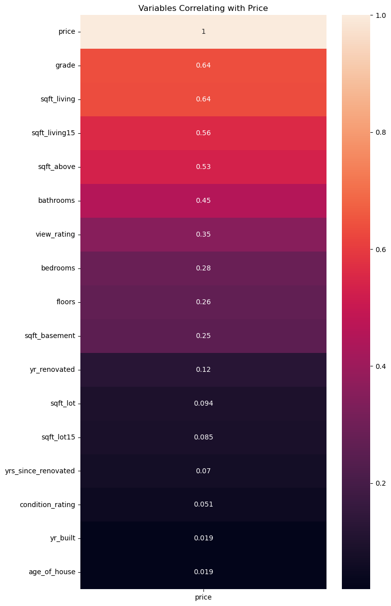
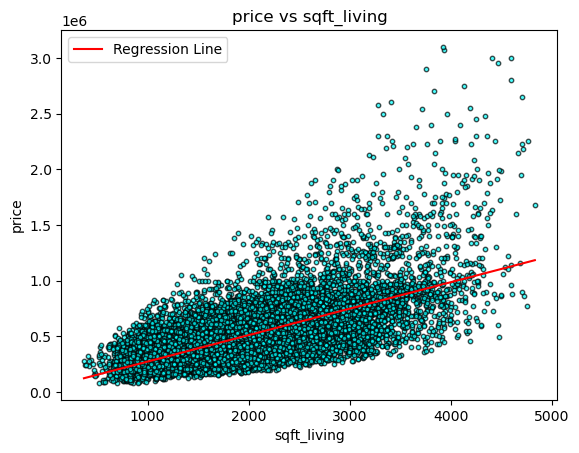
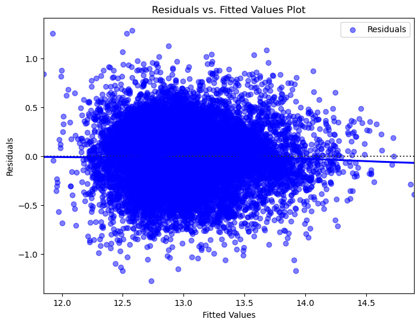
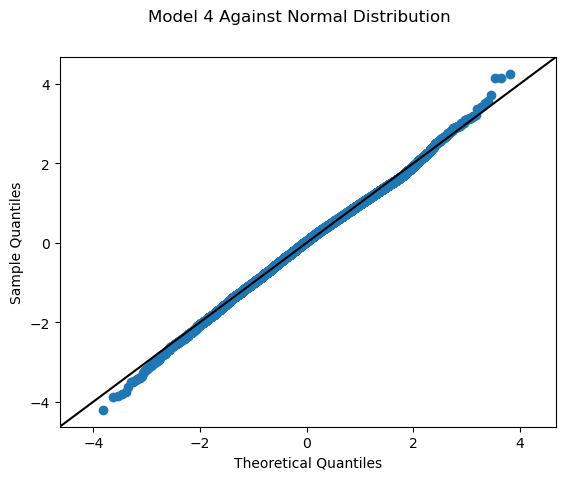

# King County House Pricing Model

**Authors:** 
***

    

***
# Overview
As part of a real estate agency, we came up with a project that helps homeowners buy and/or sell homes in northwestern bound King County.
***
## Business Problem
The real estate agency aims to assist homeowners in King County with selling their properties by providing advice on which features influence house prices.
***
### Main Objective
The main focus of this project is to identify the key factors that affect home prices in the area, allowing homeowners to make informed decisions about pricing strategies and property enhancements to maximize their sale potential.
Important research questions
1. Market Analysis:
What are the current market trends and conditions in King County's real estate market?
What is the outlook for the King County real estate market in terms of future growth and stability?
2. Property Characteristics:
What are the typical features and characteristics of homes that command higher prices in King County?
How do factors like property size, number of bedrooms and bathrooms, floor plan layout, and architectural style correlate with home prices?
3. Neighborhood Analysis:
Does the quality of view of houses have a significant effect on price?

## Data Understanding
### 1. Where did the data come from, and how do they relate to the data analysis questions? 
The data comes from the King County House Sales dataset, which likely contains information on various properties sold in King County, Washington. This dataset is relevant to the data analysis questions as it provides insights into the factors influencing house prices in the area.

### 2. What do the data represent? Who is in the sample and what variables are included?
The data in the King County House Sales dataset represent information about house sales in King County, Washington. Each row in the dataset likely represents a single house sale transaction, with various attributes recorded for each property.
The dataset provides a comprehensive view of house sales in King County, including details about the properties sold and their associated attributes. This information is valuable for analyzing market trends, understanding factors influencing house prices, and providing insights to homeowners and real estate professionals.

### 3. What is the target variable?
In the King County House Sales dataset, the target variable is likely the "price" column. This variable represents the sale price of the houses. The goal of the analysis is typically to predict house prices based on various features such as square footage, number of bedrooms, bathrooms, location, and other relevant attributes. Therefore, the "price" variable is the main focus of the analysis, and the regression models will be trained to predict this target variables.

>## Results
- What features are higly correlated with the sale price ?

For continuous variables :`sqft_living`, `sqft_above`, `sqft_living15`
For discrete variables :`bedrooms`,`bathrooms`, `grade`,`waterfront`.seem to show acorrelational increase in the median price as well as  agreater spread of prices in some cases
**Simple Linear Regression**

**Model 1**

- The R-squared of this model is 0.404 which  means the model explains abput 40.4% of the variance in the target variable(price) which is not that great

**Multiple linear Regression**

**Model 2**

**R-squared:** The R-squared value is 0.540, indicating that approximately 54% of the variance in housing prices is explained by the independent variables included in the model. 
**Coefficients:** 
    1. `bedrooms`: Each additional bedroom is associated with a decrease in housing prices by approximately 47,910, holding other variables constant. 
    2. `bathrooms`: Each additional bathroom is associated with an increase in housing prices by approximately 51,560, holding other variables constant. 
    3. `floors`: Each additional floor is associated with an increase in housing prices by approximately 68,110, holding other variables constant. 
    4. `condition_rating`: Each unit increase in the condition rating is associated with an increase in housing prices by approximately 22,990, holding other variables constant. 

**Model 3**

The R-squared of the model is 0.635 which explains 63.5% of the variance in housing prices which is explained by the independent variables included in the model which is an improvement compared to the first and the second model

**Model 4**

Logarithmic transformation
The R-squared of this model is 0.620 which means the model explains 62.0% is lower than the R-squared of the previous model model 3

Normality Test after Log Transformation

This test suggests that the residuals after logarithmic transformation the distribution of the residuals was homoskedastic

This normality test suggests that the residuals after log transformation follows a normal distribution.

## Regression Results
## Evaluation
### Based on the analysis conducted on the King County House Sales dataset, we have gathered several insights:
***
####  1. Key Factors Affecting House Prices:
* Square footage of living space appears to have the most significant impact on house prices, as evidenced by its high correlation with price.
* Other features such as square footage of living space, grade, waterfront status, and year of renovation also show notable correlations with house prices, indicating their influence on property values.

#### 2. Significance of Property Characteristics:
* The number of bedrooms and bathrooms also plays a role in determining house prices, although their individual impacts may vary.
* Renovation status can affect house prices, with recently renovated properties likely commanding higher values.

#### 3. Neighborhood and Environmental Factors:
* Proximity to amenities seems to correlate positively with house prices, suggesting that location plays a crucial role in property valuation.
* Waterfront properties are associated with premium prices, indicating the desirability of waterfront locations among buyers.
* Other neighborhood factors such as view and property condition also contribute to variations in house prices.

#### 4. Modeling and Predictive Insights:
* Various regression models, including Simple Linear Regression and Multiple Linear Regression, have been applied to understand the relationships between independent variables and house prices.
* Iterative modeling and feature engineering have helped refine the predictive accuracy of the models, allowing for better insights into the factors influencing house prices.
## Conclusions
***
###### In addition to the insights gathered, it's essential to consider the limitations of this analysis:
* The dataset used for this analysis was limited to a specific geographic area and time period. It may not be representative of other locations or time periods, which could limit the generalizability of the results.
* The data in the dataset is from 2014 and 2015. Therefore, it may not be able to account for changes in the housing market since then. As a result, the model may not accurately predict the value of a house in 2024.
* While the model can identify relationships between variables, it cannot prove causality. Therefore, it's important to be cautious about making causal claims based solely on the results of this model.
* Overall, the analysis provides valuable insights for homeowners, real estate professionals, and potential buyers interested in the King County housing market. By understanding the key factors affecting house prices and acknowledging the limitations of the analysis, stakeholders can make informed decisions regarding pricing strategies, property enhancements, and investment opportunities. Further research and analysis may be warranted to explore additional factors or refine existing models for better predictive accuracy actionable insights.
***
***
