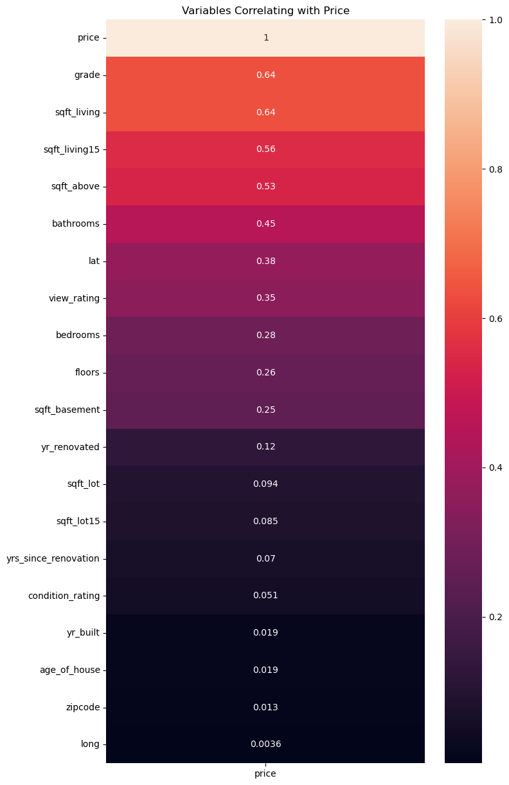

# King County House Pricing Model

**Authors: GROUP 3 Members** 

---

    

# Overview
>### Project Focus
>  * Our real estate project focuses on empowering homeowners in northwestern King County by providing actionable insights for buying and selling homes.
>### Goals
> * Empowerment: Equip homeowners with the insights and tools needed to navigate the real estate market confidently.
> * Value Optimization: Maximize the value of properties through innovative strategies and personalized guidance.
> * Transparency: Provide transparent and data-driven insights to ensure informed decision-making for both buyers and sellers.
>### Significance
> * In a rapidly evolving real estate market like King County, informed decision-making is key to success. Our project aims to revolutionize the home buying and selling experience by leveraging data-driven insights and innovative approaches.

# The Business Problem

>### Understanding the Market Dynamics
> * There's a rising market of home-buyers and home-sellers in King County, indicating a vibrant real estate landscape. However, navigating this market can be daunting for homeowners who are unsure about the key factors driving house prices. 
>### Lack of Actionable Insights
> * Many homeowners struggle to determine the optimal pricing strategies for their properties. Without actionable insights, they may underprice or overprice their homes, potentially missing out on maximizing their sale potential.
>### Uncertainty for Home Buyers
> * Home buyers face challenges in estimating the value of properties based on their preferences. They often lack guidance on the approximate price of houses that align with their desired features and budget.

# Data Understanding

>### Data Source
> * Our primary dataset, the King County House Sales dataset, serves as the foundation of our analysis. This dataset contains information on various properties sold in King County, Washington. It includes details such as property features, sale prices, and sales history. This dataset is central to our analysis as it provides insights into the factors influencing house prices in the area. The link to the dataset can be found <a href="https://www.kaggle.com/datasets/doesnotcompile/nf-kc-house-data">here</a>.

# Data Analysis
## 1. Bivariate Analysis

    

## 2. Correlation Analysis
## Results

- What features are higly correlated with the sale price ?

For continuous variables :`sqft_living`, `sqft_above`, `sqft_living15`
For discrete variables :`bedrooms`,`bathrooms`, `grade`,`waterfront`.seem to show acorrelational increase in the median price as well as  agreater spread of prices in some cases
**Simple Linear Regression**

**Model 1**

- The R-squared of this model is 0.404 which  means the model explains abput 40.4% of the variance in the target variable(price) which is not that great

**Multiple linear Regression**

**Model 2**

**R-squared:** The R-squared value is 0.540, indicating that approximately 54% of the variance in housing prices is explained by the independent variables included in the model. 
**Coefficients:** 
    1. `bedrooms`: Each additional bedroom is associated with a decrease in housing prices by approximately 47,910, holding other variables constant. 
    2. `bathrooms`: Each additional bathroom is associated with an increase in housing prices by approximately 51,560, holding other variables constant. 
    3. `floors`: Each additional floor is associated with an increase in housing prices by approximately 68,110, holding other variables constant. 
    4. `condition_rating`: Each unit increase in the condition rating is associated with an increase in housing prices by approximately 22,990, holding other variables constant. 

**Model 3**

The R-squared of the model is 0.635 which explains 63.5% of the variance in housing prices which is explained by the independent variables included in the model which is an improvement compared to the first and the second model

**Model 4**

Logarithmic transformation
The R-squared of this model is 0.620 which means the model explains 62.0% is lower than the R-squared of the previous model model 3

Normality Test after Log Transformation

This test suggests that the residuals after logarithmic transformation the distribution of the residuals was homoskedastic

This normality test suggests that the residuals after log transformation follows a normal distribution.

## Regression Results

In the `Log-Transformed Multiple Linear Regression Model`, the coefficients represent the change in the natural logarithm of the price for a one-unit change in each predictor variable, holding all other variables constant.

Here's a summarized interpretation of the results, highlighting the features that have the highest impact on housing prices:

1. **sqft_living**: A one-unit increase in square footage of living space is associated with an increase in the natural logarithm of price by 0.0002 units.

2. **sqft_living15**: Similarly, a one-unit increase in square footage of living space for the nearest 15 neighbors' houses is associated with an increase in the natural logarithm of price by 0.0001 units.

3. **floors_3.0**: Houses with three floors have the highest impact on housing prices among the different floor types, with an increase in the natural logarithm of price by 0.3067 units compared to houses with one floor, holding all else constant.

4. **waterfront_YES**: Houses with a waterfront view have a significant positive impact on housing prices, with an increase in the natural logarithm of price by 0.2947 units compared to houses without a waterfront view, holding all else constant.

5. **grade_12**: Houses with a grade of 12 have the highest impact on housing prices among the different grade levels, with an increase in the natural logarithm of price by 1.3112 units compared to houses with a lower grade, holding all else constant.

## Evaluation
### Based on the analysis conducted on the King County House Sales dataset, we have gathered several insights:
***
####  1. Key Factors Affecting House Prices:
* Square footage of living space appears to have the most significant impact on house prices, as evidenced by its high correlation with price.
* Other features such as square footage of living space, grade, waterfront status, and year of renovation also show notable correlations with house prices, indicating their influence on property values.

#### 2. Significance of Property Characteristics:
* The number of bedrooms and bathrooms also plays a role in determining house prices, although their individual impacts may vary.
* Renovation status can affect house prices, with recently renovated properties likely commanding higher values.

#### 3. Neighborhood and Environmental Factors:
* Proximity to amenities seems to correlate positively with house prices, suggesting that location plays a crucial role in property valuation.
* Waterfront properties are associated with premium prices, indicating the desirability of waterfront locations among buyers.
* Other neighborhood factors such as view and property condition also contribute to variations in house prices.

#### 4. Modeling and Predictive Insights:
* Various regression models, including Simple Linear Regression and Multiple Linear Regression, have been applied to understand the relationships between independent variables and house prices.
* Iterative modeling and feature engineering have helped refine the predictive accuracy of the models, allowing for better insights into the factors influencing house prices.
## Conclusions

### In addition to the insights gathered, it's essential to consider the limitations of this analysis:
* The dataset used for this analysis was limited to a specific geographic area and time period. It may not be representative of other locations or time periods, which could limit the generalizability of the results.
* The data in the dataset is from 2014 and 2015. Therefore, it may not be able to account for changes in the housing market since then. As a result, the model may not accurately predict the value of a house in 2024.
* While the model can identify relationships between variables, it cannot prove causality. Therefore, it's important to be cautious about making causal claims based solely on the results of this model.
* Overall, the analysis provides valuable insights for homeowners, real estate professionals, and potential buyers interested in the King County housing market. By understanding the key factors affecting house prices and acknowledging the limitations of the analysis, stakeholders can make informed decisions regarding pricing strategies, property enhancements, and investment opportunities. Further research and analysis may be warranted to explore additional factors or refine existing models for better predictive accuracy actionable insights.
***
