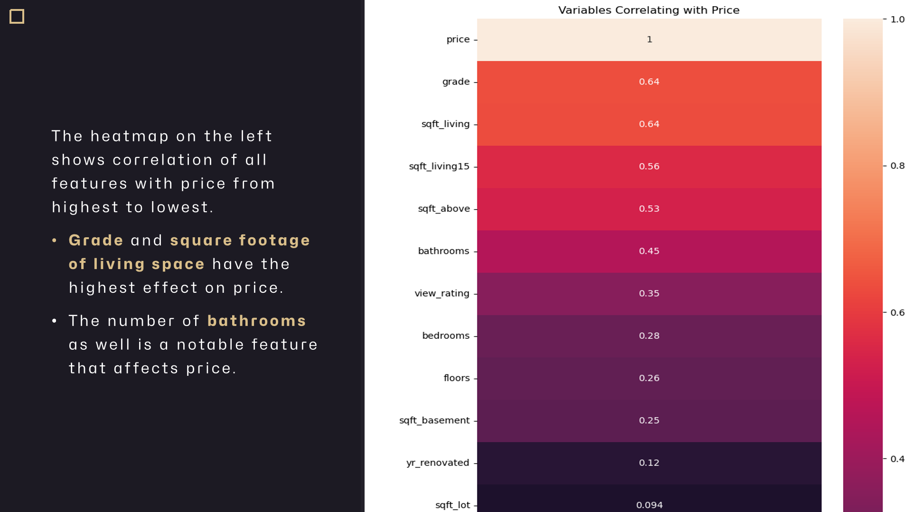

# King County House Pricing Model

**Authors: GROUP 3 Members** 

---

    

# Overview
>### Project Focus
>  * Our real estate project focuses on empowering homeowners in northwestern King County by providing actionable insights for buying and selling homes.
>### Goals
> * Empowerment: Equip homeowners with the insights and tools needed to navigate the real estate market confidently.
> * Value Optimization: Maximize the value of properties through innovative strategies and personalized guidance.
> * Transparency: Provide transparent and data-driven insights to ensure informed decision-making for both buyers and sellers.
>### Significance
> * In a rapidly evolving real estate market like King County, informed decision-making is key to success. Our project aims to revolutionize the home buying and selling experience by leveraging data-driven insights and innovative approaches.

# The Business Problem

>### Understanding the Market Dynamics
> * There's a rising market of home-buyers and home-sellers in King County, indicating a vibrant real estate landscape. However, navigating this market can be daunting for homeowners who are unsure about the key factors driving house prices. 
>### Lack of Actionable Insights
> * Many homeowners struggle to determine the optimal pricing strategies for their properties. Without actionable insights, they may underprice or overprice their homes, potentially missing out on maximizing their sale potential.
>### Uncertainty for Home Buyers
> * Home buyers face challenges in estimating the value of properties based on their preferences. They often lack guidance on the approximate price of houses that align with their desired features and budget.

# Data Understanding

>### Data Source
> * Our primary dataset, the King County House Sales dataset, serves as the foundation of our analysis. This dataset contains information on various properties sold in King County, Washington. It includes details such as property features, sale prices, and sales history. This dataset is central to our analysis as it provides insights into the factors influencing house prices in the area. The link to the dataset can be found <a href="https://www.kaggle.com/datasets/doesnotcompile/nf-kc-house-data">here</a>.

# Data Analysis
## 1. Bivariate Analysis

    

---

    

---

    

## 2. Correlation Analysis

Which features are highly correlated with the sale price?

    

Continuous variables (`sqft_living`, `sqft_above`, `sqft_living15`) and discrete variables (`bedrooms`,`bathrooms`, `grade`,`waterfront`) seem to show the highest correlational increase in the median price as well as  a greater spread of prices in some cases.

# Data Modeling 
## Base Predictor Model: Simple Linear Regression(SLR)

    

>The R-squared of this model is 0.404 which means the model explains about 40.4% of the variance in the target variable(price).

## Model 2: Multiple linear Regression Approach(MLR)

>**R-squared:** The R-squared value is 0.540, indicating that approximately 54% of the variance in housing prices is explained by the independent variables included in the model. 
**Coefficients:** 
    1. `bedrooms`: Each additional bedroom is associated with a decrease in housing prices by approximately $48K, holding other variables constant. 
    2. `bathrooms`: Each additional bathroom is associated with an increase in housing prices by approximately $51.5K, holding other variables constant. 
    3. `floors`: Each additional floor is associated with an increase in housing prices by approximately $68K, holding other variables constant. 
    4. `condition_rating`: Each unit increase in the condition rating is associated with an increase in housing prices by approximately $23K, holding other variables constant. 

## Model 3: One-Hot Encoded Multiple Linear Regression(One-Hot MLR)

>The R-squared of the model is 0.738 which explains 73.8% of the variance in housing prices which is explained by the independent variables included in the model which is an improvement compared to the first and the second model

## Model 4: Log-Transformed Multiple Linear Regression(Log-MLR)

>The R-squared of this model is 0.784 which means the model explains 78.4% is lower than the R-squared of the previous model model 3.

### Normality Test after Log Transformation

    

>This test suggests that the residuals after logarithmic transformation the distribution of the residuals was homoskedastic.

    

>This normality test suggests that the residuals after log transformation follows a normal distribution.

# Regression Results

In the `Log-Transformed Multiple Linear Regression Model`, the coefficients represent the change in the natural logarithm of the price for a one-unit change in each predictor variable, holding all other variables constant.

Here's a summarized interpretation of the results in log notation highlighting the features that have the highest impact on housing prices:

1. **sqft_living**: A one-unit increase in square footage of living space is associated with an increase in the natural logarithm of price by 0.0002 units.

2. **sqft_living15**: Similarly, a one-unit increase in square footage of living space for the nearest 15 neighbors' houses is associated with an increase in the natural logarithm of price by 0.0001 units.

3. **floors_3.0**: Houses with three floors have the highest impact on housing prices among the different floor types, with an increase in the natural logarithm of price by 0.3067 units compared to houses with one floor, holding all else constant.

4. **waterfront_YES**: Houses with a waterfront view have a significant positive impact on housing prices, with an increase in the natural logarithm of price by 0.2947 units compared to houses without a waterfront view, holding all else constant.

5. **grade_12**: Houses with a grade of 12 have the highest impact on housing prices among the different grade levels, with an increase in the natural logarithm of price by 1.3112 units compared to houses with a lower grade, holding all else constant.

Here's a summarized interpretation of the results in percentages:

1. The average price of a house is $150K

2. Houses with a waterfront have a 33% higher price than houses with no waterfront.

3. Houses with excellent views have a 14% higher price than houses with average views.

4. The higher the grade the higher the price as houses with grade 12 (Luxury) have a 100% higher price than houses with grade 5 (Fair).

5. Houses in Medina city have the highest price, 62% higher than houses in Seattle.

6. Houses in Mercer Island have a 25% higher price and houses in Bellevue have a 16% higher price.

# Recommendations

1. We recommend prioritizing investments or improvements that enhance the square footage of living space. Given its strong correlation with house prices, increasing the living space of a property could significantly boost its value.

2. Upgrade property grades to enhance market appeal. Highlight proximity to amenities and waterfront locations in marketing efforts.

3. Consider renovations to improve overall property grade and desirability. Emphasize lifestyle benefits to attract buyers and justify premium pricing. Focus on key factors such as living space, property grade, amenities, and location to realize the full property potential in the King County market.

# Conclusions
## In addition to the insights gathered, the analysis has some limitations:

1. The dataset used for this analysis was limited to a specific geographic area and time period. It may not be representative of other locations or time periods, which could limit the generalizability of the results.

2. The data in the dataset is from 2014 and 2015. Therefore, it may not be able to account for changes in the housing market since then. As a result, the model may not accurately predict the value of a house in 2024.

3. While the model can identify relationships between variables, it cannot prove causality. Therefore, it's important to be cautious about making causal claims based solely on the results of this model.